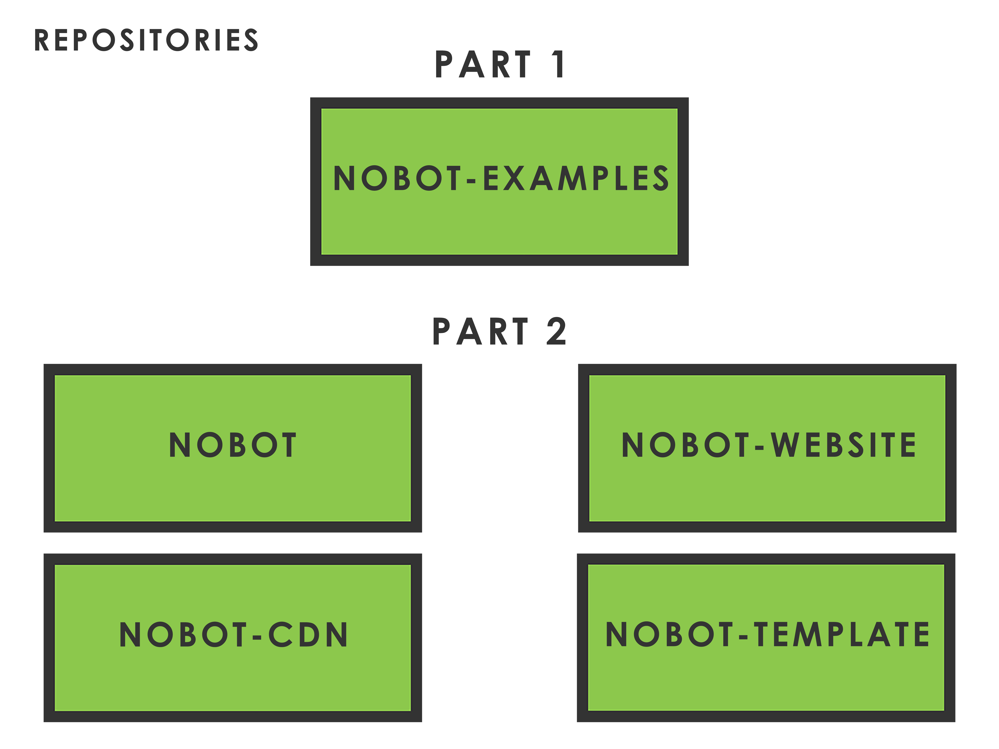

# Introduction

> "I will always choose a lazy person to do a difficult job because a lazy person will find an easy way to do it."
>
> -- *Anonymous*

## Preface

Being in the technical field presents itself with some fun... and some not so fun tasks, we can all agree upon that. For the not so fun bits I try to filter out all of the repetitive administrative work with something that I'm better known for as a developer; writing code. Yes, I can be a bit lazy, but that's because I value my time. You'd be surprised at how much time goes into updating comments on Jira, zipping files and emailing them to colleagues, updating configuration files, and copying and pasting directories. Sigh, I need to stop listing these before I fall asleep.

At a previous job I found myself doing things that could've easily been automated by a script. Anything that feels repetitive should ring alarm bells for you. If it doesn't, then you should change your mindset now. Look at what you do on a daily basis, think about it, read this book, and see if it changes your perspective. Ideally it should.

On one weekend, after noticing repetitive tasks at work, I took note of the steps involved in these tasks from start to finish, and set out to build a suite of commands that would automate them. It proved to be efficient for both me and some of my teammates, and it gave me more time to concentrate on Reddit... I mean, my work.

I remember reading a funny story about a programmer who automated anything that took longer than ninety seconds. His coffee machine was connected to the local network, and he sent commands to it and timed how long it took for him to walk over to pick up his freshly brewed cup. He even programmed it to send a text message via Twilio to his wife if his machine was logged in fifteen minutes after the end of the working day, saying he was working late that night.

Being fairly accustomed to using Bash scripting in the past on a Linux virtual machine, I decided initially it was the right tool for what I wanted to achieve. I'd need access to the file system. I could make use of the powerful searching commands, store variables, read in standard input from the user, and use conditional statements to decide on how to proceed. Perfect! But then I thought, I wonder if I can achieve the same with Node JS?

I created the bash version initially, but digging further, I learned I could create the project with npm directly. So I rewrote the project and presented it to the team. The great news was that me and my team were allocated time to work on the project during work hours, and one of the technical architects was keen to integrate this tool into our workflow. Winning!

We are using Node, but not in the traditional sense. There are two ways we can implement the code you will be learning in this book. You can treat it as a global list of commands that behave in the same way as an alias on a terminal, or you can create a build tool that deploys your project, taking care of all the tedious tasks you are used to doing.

This book will help you build something along the lines of what I have, but it's obvious to point out that every company's workflow follows a different path and set of business rules. Don't worry though, section two of this book explains a good way of identifying and detailing your workflow. Once you have identified this path and the associated workflow, it should be pretty straightforward to apply the knowledge acquired from this book.

## End Goal

Let's not beat around the bush. Once you've finished reading this book, you should be able to create global commands and a working bespoke Node build tool that allows you to automate the repetitive tasks you hate doing. This build tool will be shaped around your company's goals, or your own. Either way, the intention is to make your life easier. Because life is hard enough as it is, right?

## Structure

The book is structured into two parts:

### Part 1

The first part is a collection of recipes, or building blocks that behave as individual global commands. These can be used as you go about your day, and can be called at any time to speed up your workflow or just for pure convenience.

It begins with simple examples so you can get to know more about Node's standard library, then moves into more practical implementations. Each recipe corresponds with the **'examples'** directory found in the repository. All of the examples can be found here: <https://github.com/smks/nobot-examples>

### Part 2

The second part is a walkthrough of creating a cross-platform build tool from the ground up. Each script that achieves a certain task will be its own command, with a main umbrella command -- usually the name of your project -- encapsulating them all.

Instead of using Gulp or Grunt, we will be using npm directly. The plan is to keep this tool as lightweight as possible. I will be calling the project **Nobot**, because I love naming projects, it's an obsession. The implementation can be found here: <https://github.com/smks/nobot>



### Book Coding Style

This book uses examples when working on a Mac and sometimes Windows. You may occasionally see different output.

The coding style follows AirBnb coding standards with ESLint. A few rules have been overridden because comma dangles look horrendous.

```javascript
const a = {
  b: '1',
  c: '2', // omg wtf
}
```

### Code snippets

The book will have a lot of code snippets, as you'd expect.

Below is how I would demonstrate a code example. It begins with the name of the script, followed by code snippets, and sections of content in between to explain what is happening.

#### { width=75px height=75px } my-script.js

This is where I introduce you to what is happening below.

 ```javascript
// start of script
console.log('this is part 1 of my-script.js');
 ```

Above is the first bit of code. This is where I bore you of the details of what's going on, or what will happen next.

```javascript
console.log('this is part 2 of my-script.js');
// end of script
```

Below is the output of the script '**my-script.js**'

```txt
$ node my-script.js
this is part 1 of my-script.js
this is part 2 of my-script.js
```

#### Did you know

When I'm feeling a bit generous, I provide some explanations to relevant areas associated with the code that we write.

{ width=360px height=339px }

> **Immutability**
> in the context of programming - an immutable object is an object whose state cannot be changed once created. This can be useful because when you pass references of that object around, you can be rest assured other procedures will not be cheeky and modify it.

#### Coding time

When you see this pencil icon, get ready, because it's time to roll up your sleeves and get coding!

{ width=10% height=10% }

#### Running a terminal command

When I need to use the CLI, it may show as a single line.

```txt
node index.js
```

For multi-line, I will prefix the first line with a dollar sign.

```txt
$ npm install fs-extra
fetching fs-extra...
```

### Prerequisites

1. A Laptop or Desktop.
1. Internet Access.
1. A GitHub Account with SSH set up correctly.
1. Ensure you are using the latest version of git to avoid legacy issues.
1. Make sure you have Node installed. This can be downloaded here for your Mac or Windows machine: <https://nodejs.org/en>. This book uses a minimum version of: **6.9.1**. At the time of writing, it should be fine to use any version above this.
1. Motivation. Please stick with it. The time you invest now will pay off in the long run.

### Assumptions

It's assumed you have a simple understanding of JavaScript and GitHub. A basic idea of the CLI, and minimal - or no - experience of Node JS. All third party implementations are correct at the time of writing. Node throughout the book will be referenced as: Node, Node JS or Node.js but refers to the same technology.

### Suggestions

Please feel free to suggest or contribute on GitHub (Raise a pull request) to the code examples as you see fit, or any possible typos in this book. You can also contact me via any of the social networks.

- GitHub - <https://github.com/smks>
- Twitter - <https://twitter.com/shaunmstone>
- Facebook - <https://www.facebook.com/automatingwithnodejs>
- YouTube - <http://www.youtube.com/c/OpenCanvas>

Or connect with me on LinkedIn for business-related requests.

LinkedIn - <https://www.linkedin.com/in/shaunmstone>
